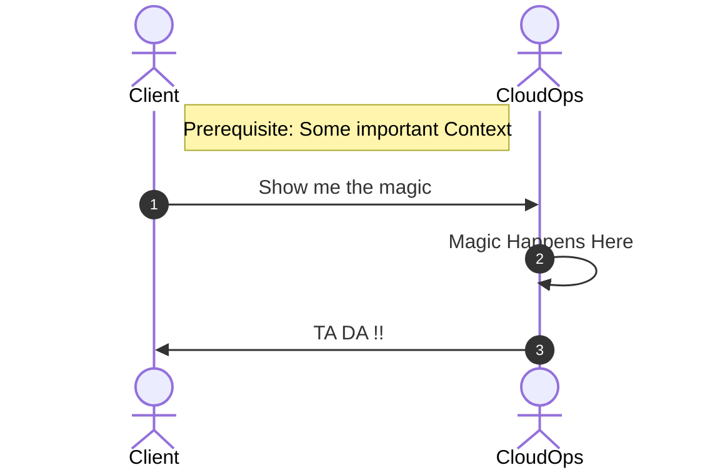

# Feature Request: [TITLE]

## Request Information

- Request Type: **[BUG | PRODUCT IMPROVEMENT | NEW FEATURE]**
- Feature Champion: **[NAME], [ROLE]**
- Board Reference: **[EPIC or FEATURE or BUG link]**

## User Story

```
As a [user concerned by the story]
I want [goal of the story]
So that [reason for the story]
```

## Context / More Information

### User Experience Sequence Diagram



### Previous Discussions

*Any summaries of previous discussions (with links if possible) that are important background information.*

*Example:*

- *Google Demo of Self Service portal - March 15 2024 - provides a good starting point for this feature.  A recording of that demo is available [here](#previous-discussions).*

### Constraints

*Any technical or non-technical constraints that we are aware of at this time that might impact the solution*

### Concerns / Questions

*Open concerns or unanswered questions that should be considered during the design proposal phase*

*Example: Securing the self-service portal for PBMM might be a lot of effort as we have to compete with the control that the gitops mode brings.  Is it possible to scope the feature in 2 phases, one for Profile 1/2 and a future release for Profile 3/5/6*

### Related Links

*any internal or external links relevant*

## Key Product Considerations

> **Guiding Principle:** 
> The LZ should be seen as an enabler for an Application DevOps team.  From their perspective the product should: accelerate the deployment of secure application infrastructure in a light-touch manner and wherever possible focus on self-service over direct interaction with SSC.

## Summary of Key Requirements

### Functional Requirements

### Non-Functional Requirements

## Cloud Strategy Input

*to be completed with Strategy team*

### Alignment to Capability Model

### Alignment to Roadmap

### Alignment to Horizontal Services

## Priority Statement

*Explain the business priority and technical priority*

*Example: The SSC CaC team has a parliamentary deadline to SA&A their solution and this requires our LZ to support Profile 3.  Delays in getting this feature deployed have a huge impact for SSC.  With this in mind, this is a **HIGH** priority*

## Success Criteria

*what is going to be the key measures of success when evaluating the initial implementation of this feature*

## Status

*Select one of:*

```
Draft
In Review
To Be Subdivided in smaller features
Approved by [Product Manager] on [YYYY-MM-DD], require Proposal
Approved by [Product Manager] on [YYYY-MM-DD], proceed to Design Brief
Cancelled by [Product Manager]on [YYYY-MM-DD] for [Reason]
Delayed (Kept for future consideration)
```

## Next Steps

*One of:*

```
Create Design Proposal Spike to create design proposal
Create Design Brief Spike to create a design brief 
Refine Further [with whom and why]
N/A
```