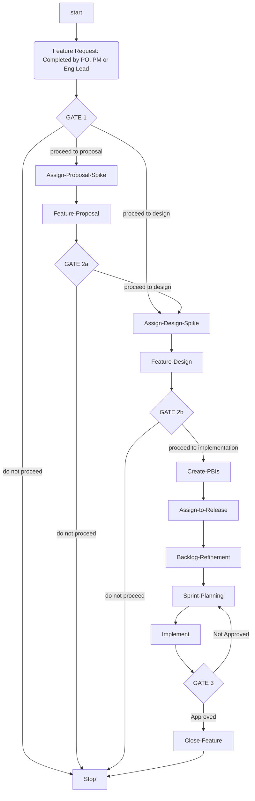

# Process Overview

```mermaid
flowchart TD
  Feature-Request(Feature Request: Completed by PO, PM or Eng Lead)

  Feature-Governance{GATE 1}
  Proposal-Governance{GATE 2a}
  Design-Governance{GATE 2b}
  Sprint-Review{GATE 3}

  start --> Feature-Request
  Feature-Request --> Feature-Governance

  Feature-Governance -- proceed to design --> Assign-Design-Spike
  Feature-Governance -- proceed to proposal --> Assign-Proposal-Spike
  Feature-Governance -- do not proceed --> Stop

  Assign-Proposal-Spike --> Feature-Proposal
  Feature-Proposal --> Proposal-Governance
  
  Proposal-Governance -- do not proceed --> Stop
  Proposal-Governance -- proceed to design --> Assign-Design-Spike

  Assign-Design-Spike --> Feature-Design
  Feature-Design --> Design-Governance

  Design-Governance -- proceed to implementation --> Create-PBIs
  Design-Governance -- do not proceed --> Stop

  Create-PBIs --> Assign-to-Release
  Assign-to-Release --> Backlog-Refinement --> Sprint-Planning --> Implement --> Sprint-Review

  Sprint-Review -- Approved --> Close-Feature --> Stop
  Sprint-Review -- Not Approved --> Sprint-Planning

```